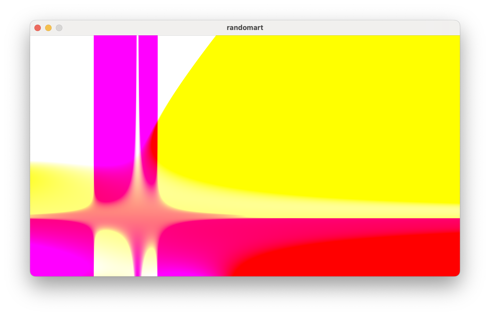

# Random Expression Shader

Small experimental project that generates random mathematical expressions, builds an AST, and evaluates it either on the CPU or as a GLSL fragment shader using **raylib**.

Each run produces a different procedural image.
RGB values come from a randomly generated `vec3(x, y, t)` expression.

for this random function :

```
vec3((t+t),(y+((((((((x+-0.187478)*(x+x))*((0.469741+x)+(x*0.152370)))*x)*0.274633)*(t+((x*((0.236117+y)*(0.424299*0.443195)))*(x+((y*y)+(-0.264623*0.041869))))))*(0.221296+((((t*t)*((y*y)*(y+y)))*t)*(t+t))))+(0.314177*-0.007430))),((y+((((y*((x+(x*x))+(0.451547+y)))+x)*(((t+((-0.098244+x)+y))*(((x+x)+(0.133327+0.219884))*((y*y)*(-0.422653+-0.203178))))+(y*((y*(y*y))+((x+0.211402)*(y+y))))))+x))*y))
```

we got



## Features

* Random AST generation (add, mul, constants, x/y/t)
* Single expression evaluated as:
  * Runtime-generated GLSL fragment shader

## Build

```
cc build.c -o builder && ./builder clean run gpu
```


## Inspiration

Inspired by:

Adrian Sampson, *Validation and Synthesis of Randomly Generated Programs*
[https://users.ece.cmu.edu/~adrian/projects/validation/validation.pdf](https://users.ece.cmu.edu/~adrian/projects/validation/validation.pdf)

## Notes

Experimental / exploratory code. No parsing, no optimization, no guarantees.

---
